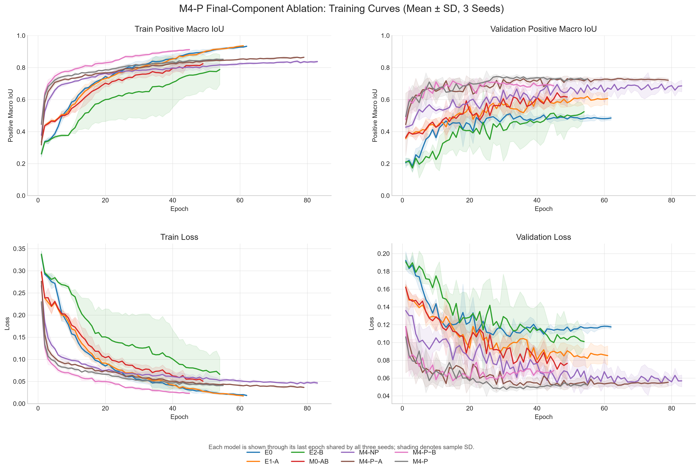

# Kaggle 3M M4-P 最终组件三随机种子消融报告

生成时间：2026-08-06T10:24:34+08:00。

## 1. 实验目的

以 E0 为正式 baseline，以 M4-P 为最终模型，通过严格单变量比较验证三通道输入（A）、轻量增强（B）、ResNet34 结构（C）和 ImageNet 预训练（D）。

训练随机种子：42, 123, 2026。所有实验使用同一个 clean patient-level manifest，六名灰度等价患者均已排除。

数据包含 104 名患者、3629 张切片；测试集包含 10 名患者、525 张切片。

## 2. 实验矩阵

| 模型 | 定义 | 配置 |
|---|---|---|
| E0 | 单通道 FLAIR，无增强，普通 U-Net | [configs/kaggle_3m_multimodal_only_e0_flair_unet.yaml](../configs/kaggle_3m_multimodal_only_e0_flair_unet.yaml) |
| E1-A | 三通道，无增强，普通 U-Net | [configs/kaggle_3m_multimodal_only_e1_rgb_unet_no_augmentation.yaml](../configs/kaggle_3m_multimodal_only_e1_rgb_unet_no_augmentation.yaml) |
| E2-B | 单通道 FLAIR，轻量增强，普通 U-Net | [configs/kaggle_3m_multimodal_only_e2_flair_unet_augmentation.yaml](../configs/kaggle_3m_multimodal_only_e2_flair_unet_augmentation.yaml) |
| M0-AB | 三通道，轻量增强，普通 U-Net | [configs/kaggle_3m_multimodal_only_m0_rgb_unet.yaml](../configs/kaggle_3m_multimodal_only_m0_rgb_unet.yaml) |
| M4-NP | 三通道，轻量增强，ResNet34，无预训练 | [configs/kaggle_3m_multimodal_only_m4_no_pretrain_rgb_resnet34_unet.yaml](../configs/kaggle_3m_multimodal_only_m4_no_pretrain_rgb_resnet34_unet.yaml) |
| M4-P−A | 单通道 FLAIR，轻量增强，ResNet34，ImageNet 预训练 | [configs/kaggle_3m_multimodal_only_m4_p_minus_a_flair_resnet34_unet.yaml](../configs/kaggle_3m_multimodal_only_m4_p_minus_a_flair_resnet34_unet.yaml) |
| M4-P−B | 三通道，无增强，ResNet34，ImageNet 预训练 | [configs/kaggle_3m_multimodal_only_m4_p_minus_b_rgb_resnet34_unet_no_augmentation.yaml](../configs/kaggle_3m_multimodal_only_m4_p_minus_b_rgb_resnet34_unet_no_augmentation.yaml) |
| M4-P | 三通道，轻量增强，ResNet34，ImageNet 预训练 | [configs/kaggle_3m_multimodal_only_m4_rgb_resnet34_unet.yaml](../configs/kaggle_3m_multimodal_only_m4_rgb_resnet34_unet.yaml) |

## 3. 各随机种子 Test Positive Macro IoU

| 模型 | Seed 42 | Seed 123 | Seed 2026 | Mean ± SD |
|---|---:|---:|---:|---:|
| E0 | 0.6382 | 0.6515 | 0.6708 | 0.6535 ± 0.0164 |
| E1-A | 0.6442 | 0.6960 | 0.6484 | 0.6629 ± 0.0287 |
| E2-B | 0.7135 | 0.7160 | 0.7024 | 0.7106 ± 0.0072 |
| M0-AB | 0.6336 | 0.7097 | 0.7448 | 0.6961 ± 0.0568 |
| M4-NP | 0.7606 | 0.7603 | 0.7583 | 0.7597 ± 0.0013 |
| M4-P−A | 0.7368 | 0.7573 | 0.7926 | 0.7622 ± 0.0282 |
| M4-P−B | 0.7675 | 0.7404 | 0.7623 | 0.7567 ± 0.0144 |
| M4-P | 0.7753 | 0.7656 | 0.7582 | 0.7664 ± 0.0086 |

## 4. 测试指标 Mean ± SD

| 模型 | Positive IoU | Positive Dice | Micro IoU | Precision | Recall | 空切片误报率 |
|---|---:|---:|---:|---:|---:|---:|
| E0 | 0.6535 ± 0.0164 | 0.7342 ± 0.0147 | 0.6820 ± 0.0228 | 0.8892 ± 0.0295 | 0.7453 ± 0.0152 | 15.8144 ± 6.2003% |
| E1-A | 0.6629 ± 0.0287 | 0.7410 ± 0.0343 | 0.6914 ± 0.0044 | 0.8683 ± 0.0338 | 0.7739 ± 0.0307 | 14.2045 ± 5.8704% |
| E2-B | 0.7106 ± 0.0072 | 0.7962 ± 0.0074 | 0.7326 ± 0.0491 | 0.8793 ± 0.0830 | 0.8167 ± 0.0167 | 14.4886 ± 14.5996% |
| M0-AB | 0.6961 ± 0.0568 | 0.7804 ± 0.0504 | 0.6466 ± 0.1214 | 0.7673 ± 0.1109 | 0.7976 ± 0.0850 | 22.1591 ± 12.6444% |
| M4-NP | 0.7597 ± 0.0013 | 0.8356 ± 0.0053 | 0.7969 ± 0.0254 | 0.8869 ± 0.0201 | 0.8868 ± 0.0149 | 12.0265 ± 1.4578% |
| M4-P−A | 0.7622 ± 0.0282 | 0.8402 ± 0.0280 | 0.8004 ± 0.0120 | 0.9263 ± 0.0089 | 0.8550 ± 0.0189 | 11.1742 ± 6.5669% |
| M4-P−B | 0.7567 ± 0.0144 | 0.8357 ± 0.0110 | 0.7763 ± 0.0457 | 0.8708 ± 0.0368 | 0.8765 ± 0.0221 | 18.9394 ± 8.9673% |
| M4-P | 0.7664 ± 0.0086 | 0.8425 ± 0.0101 | 0.7926 ± 0.0153 | 0.8710 ± 0.0058 | 0.8983 ± 0.0239 | 18.1818 ± 2.2188% |

## 5. 逐随机种子严格配对消融效应

正值表示加入对应组件后 Test Positive Macro IoU 提高。

| 组件 | 严格比较 | Seed 42 | Seed 123 | Seed 2026 | Mean ± SD | 正向种子 |
|---|---|---:|---:|---:|---:|---:|
| 完整方案 | M4-P − E0 | +0.1371 | +0.1141 | +0.0874 | 0.1129 ± 0.0249 | 3/3 |
| 最终模型中的三通道输入 A | M4-P − M4-P−A | +0.0385 | +0.0082 | -0.0344 | 0.0041 ± 0.0366 | 2/3 |
| 最终模型中的轻量增强 B | M4-P − M4-P−B | +0.0078 | +0.0252 | -0.0041 | 0.0096 ± 0.0148 | 2/3 |
| ResNet34 结构 C | M4-NP − M0-AB | +0.1270 | +0.0506 | +0.0134 | 0.0637 ± 0.0579 | 3/3 |
| ImageNet 预训练 D | M4-P − M4-NP | +0.0147 | +0.0053 | -0.0000 | 0.0066 ± 0.0075 | 2/3 |

## 6. 患者级配对分析

先对每名患者的正切片 IoU 求均值，再对训练种子求均值；95% CI 使用患者作为重采样单位进行 10,000 次配对 bootstrap。测试患者较少，区间仅用于描述不确定性。

| 组件 | 患者级平均差值 | 改善患者 | 配对 bootstrap 95% CI |
|---|---:|---:|---:|
| 完整方案 | +0.1053 | 9/10 | [+0.0181, +0.2335] |
| 最终模型中的三通道输入 A | +0.0027 | 4/10 | [-0.0112, +0.0221] |
| 最终模型中的轻量增强 B | +0.0112 | 5/10 | [-0.0091, +0.0357] |
| ResNet34 结构 C | +0.0673 | 10/10 | [+0.0331, +0.1071] |
| ImageNet 预训练 D | +0.0001 | 6/10 | [-0.0224, +0.0258] |

## 7. 训练与验证稳定性

| 模型 | Best Epoch | Val Positive IoU | Train–Val Gap | 训练时间 |
|---|---:|---:|---:|---:|
| E0 | 33.3333 ± 1.5275 | 0.5247 ± 0.0115 | 0.3120 ± 0.0269 | 25.8890 ± 0.6805 min |
| E1-A | 36.3333 ± 4.7258 | 0.6470 ± 0.0405 | 0.1918 ± 0.0621 | 26.8739 ± 1.7298 min |
| E2-B | 61.0000 ± 44.9333 | 0.5807 ± 0.0114 | 0.2197 ± 0.0865 | 36.5209 ± 17.9760 min |
| M0-AB | 34.3333 ± 15.5027 | 0.7050 ± 0.0285 | 0.0544 ± 0.0360 | 26.3714 ± 6.2483 min |
| M4-NP | 60.6667 ± 10.7858 | 0.7278 ± 0.0272 | 0.0953 ± 0.0247 | 44.5344 ± 5.1722 min |
| M4-P−A | 51.6667 ± 3.0551 | 0.7413 ± 0.0007 | 0.1003 ± 0.0047 | 66.3225 ± 2.3700 min |
| M4-P−B | 22.3333 ± 6.4291 | 0.7303 ± 0.0046 | 0.1165 ± 0.0374 | 43.7287 ± 5.2071 min |
| M4-P | 28.0000 ± 5.1962 | 0.7547 ± 0.0058 | 0.0573 ± 0.0115 | 28.6224 ± 2.3717 min |

## 8. 三随机种子训练曲线

曲线为三个训练种子在共同 epoch 上的均值，阴影为样本标准差。每个模型只显示到三个种子均具有记录的最后一个 epoch。

## 9. 自动结论

- 完整方案（M4-P − E0）：seed 配对效应 +0.1129 ± 0.0249，3/3 个种子为正；所有训练种子方向一致，支持该组件带来正向贡献。患者级平均差值 +0.1053，9/10 名患者改善，95% CI [+0.0181, +0.2335]。
- 最终模型中的三通道输入 A（M4-P − M4-P−A）：seed 配对效应 +0.0041 ± 0.0366，2/3 个种子为正；平均效应为正，但训练种子方向不完全一致。患者级平均差值 +0.0027，4/10 名患者改善，95% CI [-0.0112, +0.0221]。
- 最终模型中的轻量增强 B（M4-P − M4-P−B）：seed 配对效应 +0.0096 ± 0.0148，2/3 个种子为正；平均效应为正，但训练种子方向不完全一致。患者级平均差值 +0.0112，5/10 名患者改善，95% CI [-0.0091, +0.0357]。
- ResNet34 结构 C（M4-NP − M0-AB）：seed 配对效应 +0.0637 ± 0.0579，3/3 个种子为正；所有训练种子方向一致，支持该组件带来正向贡献。患者级平均差值 +0.0673，10/10 名患者改善，95% CI [+0.0331, +0.1071]。
- ImageNet 预训练 D（M4-P − M4-NP）：seed 配对效应 +0.0066 ± 0.0075，2/3 个种子为正；平均效应为正，但训练种子方向不完全一致。患者级平均差值 +0.0001，6/10 名患者改善，95% CI [-0.0224, +0.0258]。

只有当组件的逐 seed 配对效应、患者级方向和不确定性共同支持时，才应在论文中写成稳定贡献。固定测试集只有少量患者，不能用训练种子替代患者级交叉验证或外部验证。

## 10. 原始结果

### E0

- Seed 42：[训练总结](../runs/kaggle_3m_multimodal_only_e0_flair_unet_seed42/training_summary.json)；[测试指标](../runs/kaggle_3m_multimodal_only_e0_flair_unet_seed42/test_metrics.json)；[逐切片结果](../runs/kaggle_3m_multimodal_only_e0_flair_unet_seed42/evaluation/test/samples.csv)
- Seed 123：[训练总结](../runs/kaggle_3m_multimodal_only_e0_flair_unet_seed123/training_summary.json)；[测试指标](../runs/kaggle_3m_multimodal_only_e0_flair_unet_seed123/test_metrics.json)；[逐切片结果](../runs/kaggle_3m_multimodal_only_e0_flair_unet_seed123/evaluation/test/samples.csv)
- Seed 2026：[训练总结](../runs/kaggle_3m_multimodal_only_e0_flair_unet_seed2026/training_summary.json)；[测试指标](../runs/kaggle_3m_multimodal_only_e0_flair_unet_seed2026/test_metrics.json)；[逐切片结果](../runs/kaggle_3m_multimodal_only_e0_flair_unet_seed2026/evaluation/test/samples.csv)

### E1-A

- Seed 42：[训练总结](../runs/kaggle_3m_multimodal_only_e1_rgb_unet_no_augmentation_seed42/training_summary.json)；[测试指标](../runs/kaggle_3m_multimodal_only_e1_rgb_unet_no_augmentation_seed42/test_metrics.json)；[逐切片结果](../runs/kaggle_3m_multimodal_only_e1_rgb_unet_no_augmentation_seed42/evaluation/test/samples.csv)
- Seed 123：[训练总结](../runs/kaggle_3m_multimodal_only_e1_rgb_unet_no_augmentation_seed123/training_summary.json)；[测试指标](../runs/kaggle_3m_multimodal_only_e1_rgb_unet_no_augmentation_seed123/test_metrics.json)；[逐切片结果](../runs/kaggle_3m_multimodal_only_e1_rgb_unet_no_augmentation_seed123/evaluation/test/samples.csv)
- Seed 2026：[训练总结](../runs/kaggle_3m_multimodal_only_e1_rgb_unet_no_augmentation_seed2026/training_summary.json)；[测试指标](../runs/kaggle_3m_multimodal_only_e1_rgb_unet_no_augmentation_seed2026/test_metrics.json)；[逐切片结果](../runs/kaggle_3m_multimodal_only_e1_rgb_unet_no_augmentation_seed2026/evaluation/test/samples.csv)

### E2-B

- Seed 42：[训练总结](../runs/kaggle_3m_multimodal_only_e2_flair_unet_augmentation_seed42/training_summary.json)；[测试指标](../runs/kaggle_3m_multimodal_only_e2_flair_unet_augmentation_seed42/test_metrics.json)；[逐切片结果](../runs/kaggle_3m_multimodal_only_e2_flair_unet_augmentation_seed42/evaluation/test/samples.csv)
- Seed 123：[训练总结](../runs/kaggle_3m_multimodal_only_e2_flair_unet_augmentation_seed123/training_summary.json)；[测试指标](../runs/kaggle_3m_multimodal_only_e2_flair_unet_augmentation_seed123/test_metrics.json)；[逐切片结果](../runs/kaggle_3m_multimodal_only_e2_flair_unet_augmentation_seed123/evaluation/test/samples.csv)
- Seed 2026：[训练总结](../runs/kaggle_3m_multimodal_only_e2_flair_unet_augmentation_seed2026/training_summary.json)；[测试指标](../runs/kaggle_3m_multimodal_only_e2_flair_unet_augmentation_seed2026/test_metrics.json)；[逐切片结果](../runs/kaggle_3m_multimodal_only_e2_flair_unet_augmentation_seed2026/evaluation/test/samples.csv)

### M0-AB

- Seed 42：[训练总结](../runs/kaggle_3m_multimodal_only_m0_rgb_unet_seed42/training_summary.json)；[测试指标](../runs/kaggle_3m_multimodal_only_m0_rgb_unet_seed42/test_metrics.json)；[逐切片结果](../runs/kaggle_3m_multimodal_only_m0_rgb_unet_seed42/evaluation/test/samples.csv)
- Seed 123：[训练总结](../runs/kaggle_3m_multimodal_only_m0_rgb_unet_seed123/training_summary.json)；[测试指标](../runs/kaggle_3m_multimodal_only_m0_rgb_unet_seed123/test_metrics.json)；[逐切片结果](../runs/kaggle_3m_multimodal_only_m0_rgb_unet_seed123/evaluation/test/samples.csv)
- Seed 2026：[训练总结](../runs/kaggle_3m_multimodal_only_m0_rgb_unet_seed2026/training_summary.json)；[测试指标](../runs/kaggle_3m_multimodal_only_m0_rgb_unet_seed2026/test_metrics.json)；[逐切片结果](../runs/kaggle_3m_multimodal_only_m0_rgb_unet_seed2026/evaluation/test/samples.csv)

### M4-NP

- Seed 42：[训练总结](../runs/kaggle_3m_multimodal_only_m4_no_pretrain_rgb_resnet34_unet_seed42/training_summary.json)；[测试指标](../runs/kaggle_3m_multimodal_only_m4_no_pretrain_rgb_resnet34_unet_seed42/test_metrics.json)；[逐切片结果](../runs/kaggle_3m_multimodal_only_m4_no_pretrain_rgb_resnet34_unet_seed42/evaluation/test/samples.csv)
- Seed 123：[训练总结](../runs/kaggle_3m_multimodal_only_m4_no_pretrain_rgb_resnet34_unet_seed123/training_summary.json)；[测试指标](../runs/kaggle_3m_multimodal_only_m4_no_pretrain_rgb_resnet34_unet_seed123/test_metrics.json)；[逐切片结果](../runs/kaggle_3m_multimodal_only_m4_no_pretrain_rgb_resnet34_unet_seed123/evaluation/test/samples.csv)
- Seed 2026：[训练总结](../runs/kaggle_3m_multimodal_only_m4_no_pretrain_rgb_resnet34_unet_seed2026/training_summary.json)；[测试指标](../runs/kaggle_3m_multimodal_only_m4_no_pretrain_rgb_resnet34_unet_seed2026/test_metrics.json)；[逐切片结果](../runs/kaggle_3m_multimodal_only_m4_no_pretrain_rgb_resnet34_unet_seed2026/evaluation/test/samples.csv)

### M4-P−A

- Seed 42：[训练总结](../runs/kaggle_3m_multimodal_only_m4_p_minus_a_flair_resnet34_unet_seed42/training_summary.json)；[测试指标](../runs/kaggle_3m_multimodal_only_m4_p_minus_a_flair_resnet34_unet_seed42/test_metrics.json)；[逐切片结果](../runs/kaggle_3m_multimodal_only_m4_p_minus_a_flair_resnet34_unet_seed42/evaluation/test/samples.csv)
- Seed 123：[训练总结](../runs/kaggle_3m_multimodal_only_m4_p_minus_a_flair_resnet34_unet_seed123/training_summary.json)；[测试指标](../runs/kaggle_3m_multimodal_only_m4_p_minus_a_flair_resnet34_unet_seed123/test_metrics.json)；[逐切片结果](../runs/kaggle_3m_multimodal_only_m4_p_minus_a_flair_resnet34_unet_seed123/evaluation/test/samples.csv)
- Seed 2026：[训练总结](../runs/kaggle_3m_multimodal_only_m4_p_minus_a_flair_resnet34_unet_seed2026/training_summary.json)；[测试指标](../runs/kaggle_3m_multimodal_only_m4_p_minus_a_flair_resnet34_unet_seed2026/test_metrics.json)；[逐切片结果](../runs/kaggle_3m_multimodal_only_m4_p_minus_a_flair_resnet34_unet_seed2026/evaluation/test/samples.csv)

### M4-P−B

- Seed 42：[训练总结](../runs/kaggle_3m_multimodal_only_m4_p_minus_b_rgb_resnet34_unet_no_augmentation_seed42/training_summary.json)；[测试指标](../runs/kaggle_3m_multimodal_only_m4_p_minus_b_rgb_resnet34_unet_no_augmentation_seed42/test_metrics.json)；[逐切片结果](../runs/kaggle_3m_multimodal_only_m4_p_minus_b_rgb_resnet34_unet_no_augmentation_seed42/evaluation/test/samples.csv)
- Seed 123：[训练总结](../runs/kaggle_3m_multimodal_only_m4_p_minus_b_rgb_resnet34_unet_no_augmentation_seed123/training_summary.json)；[测试指标](../runs/kaggle_3m_multimodal_only_m4_p_minus_b_rgb_resnet34_unet_no_augmentation_seed123/test_metrics.json)；[逐切片结果](../runs/kaggle_3m_multimodal_only_m4_p_minus_b_rgb_resnet34_unet_no_augmentation_seed123/evaluation/test/samples.csv)
- Seed 2026：[训练总结](../runs/kaggle_3m_multimodal_only_m4_p_minus_b_rgb_resnet34_unet_no_augmentation_seed2026/training_summary.json)；[测试指标](../runs/kaggle_3m_multimodal_only_m4_p_minus_b_rgb_resnet34_unet_no_augmentation_seed2026/test_metrics.json)；[逐切片结果](../runs/kaggle_3m_multimodal_only_m4_p_minus_b_rgb_resnet34_unet_no_augmentation_seed2026/evaluation/test/samples.csv)

### M4-P

- Seed 42：[训练总结](../runs/kaggle_3m_multimodal_only_m4_rgb_resnet34_unet_seed42/training_summary.json)；[测试指标](../runs/kaggle_3m_multimodal_only_m4_rgb_resnet34_unet_seed42/test_metrics.json)；[逐切片结果](../runs/kaggle_3m_multimodal_only_m4_rgb_resnet34_unet_seed42/evaluation/test/samples.csv)
- Seed 123：[训练总结](../runs/kaggle_3m_multimodal_only_m4_rgb_resnet34_unet_seed123/training_summary.json)；[测试指标](../runs/kaggle_3m_multimodal_only_m4_rgb_resnet34_unet_seed123/test_metrics.json)；[逐切片结果](../runs/kaggle_3m_multimodal_only_m4_rgb_resnet34_unet_seed123/evaluation/test/samples.csv)
- Seed 2026：[训练总结](../runs/kaggle_3m_multimodal_only_m4_rgb_resnet34_unet_seed2026/training_summary.json)；[测试指标](../runs/kaggle_3m_multimodal_only_m4_rgb_resnet34_unet_seed2026/test_metrics.json)；[逐切片结果](../runs/kaggle_3m_multimodal_only_m4_rgb_resnet34_unet_seed2026/evaluation/test/samples.csv)
